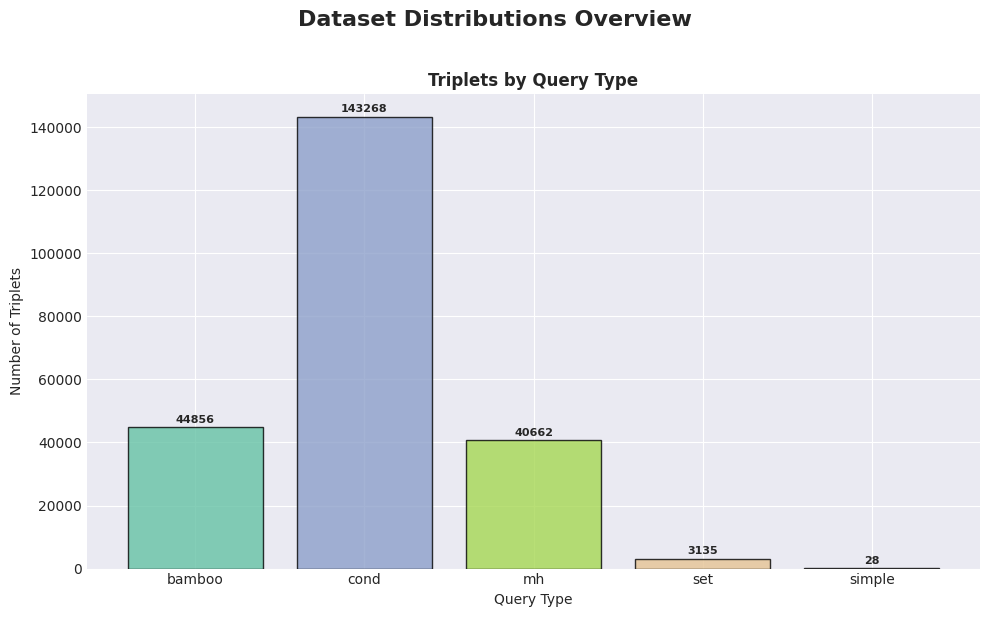
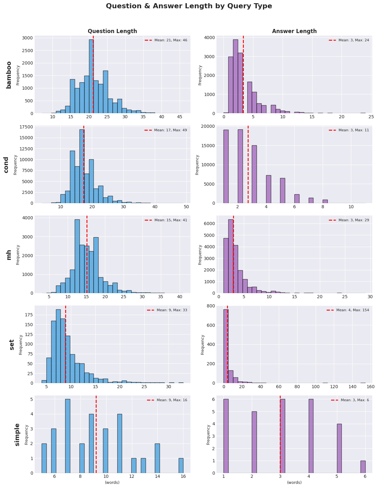
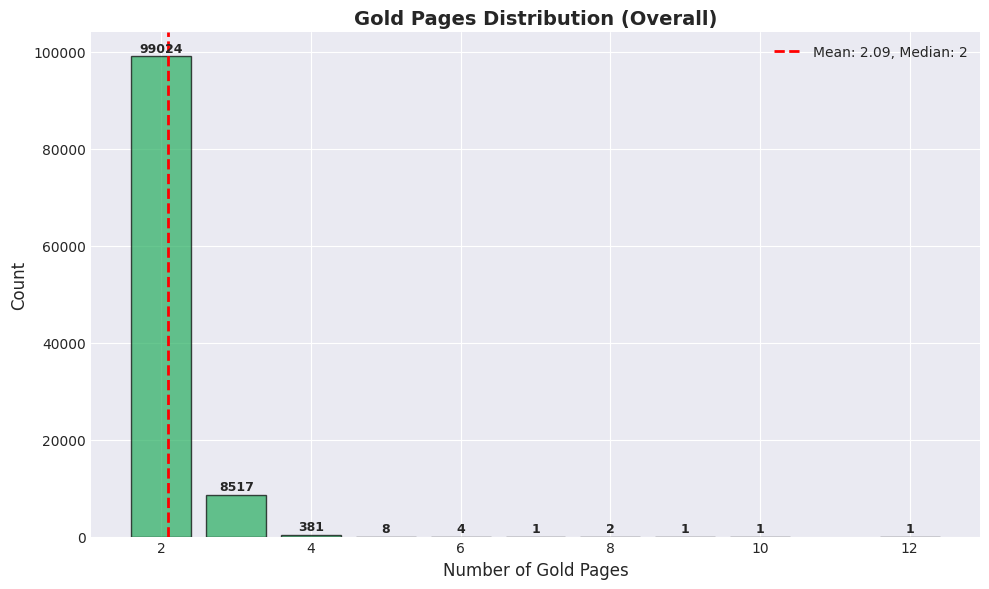
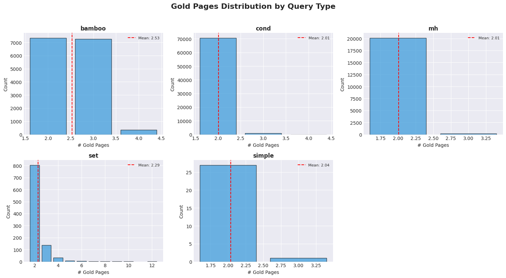
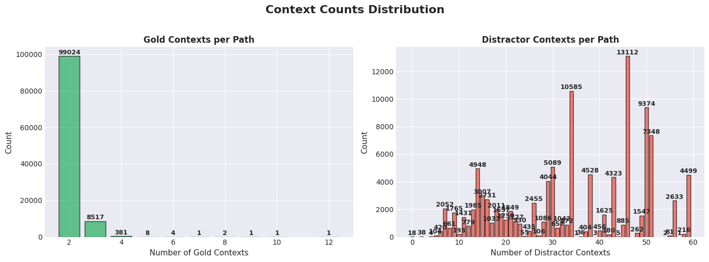
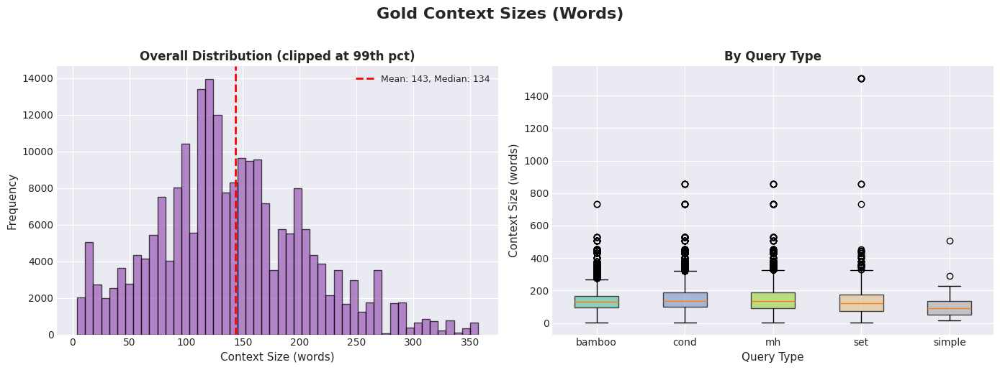
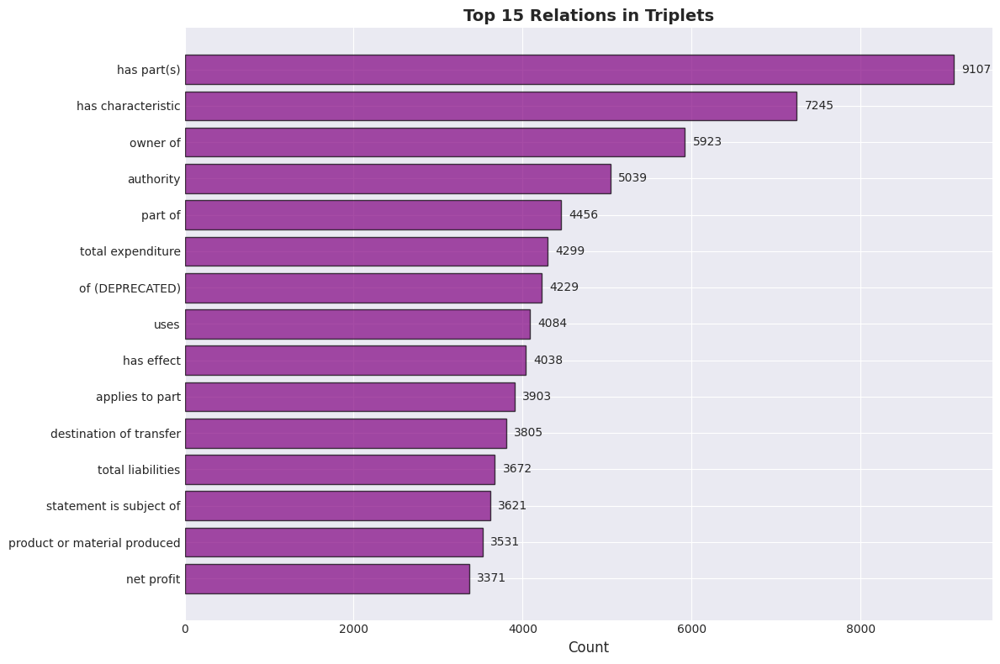
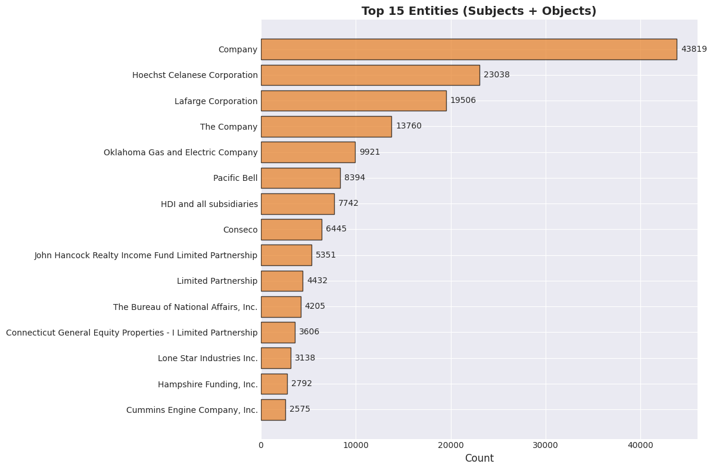
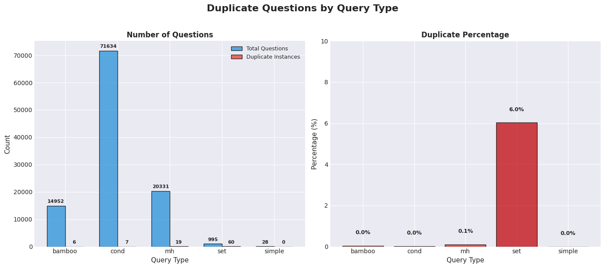

# EDGAR_ONTO_MULTI_CONTEXT_1_APRIL Multi-hop QA Dataset Analysis

## Overview

Multi-hop question-answering dataset generated from edgar_onto_multi_context_1_april using knowledge graph triplets.

## Dataset Information

- **Source**: `multi_hop/datasets/wikontic_kg/edgar/01.04.26/year_1994_corpus.json`
- **KG Dump**: `multi_hop/datasets/wikontic_kg/edgar/01.04.26/kg_dump_edgar_1994_fixed_chunked_openai_gpt-oss-120b_onto_reformatted.json`
- **Type**: musique

## Summary Statistics

| Metric | Value |
|--------|-------|
| Total Records | 107,940 |
| Records with QA | 107,940 (100.0%) |
| Unique Entry IDs | 157 |
| Total Triplets | 231,949 |
| Avg Gold Contexts | 2.09 |
| Avg Distractor Contexts | 34.63 |

## Step 2: SPARQL Query Statistics

| Metric | Value |
|--------|-------|
| Total Paths | 107,944 |
| Entries Processed | 160 |

### Paths by Query Type

| Query Type | Count |
|------------|-------|
| bamboo | 14,956 |
| cond | 71,634 |
| mh | 20,331 |
| set | 995 |
| simple | 28 |

### Path Length Distribution

| Length | Count |
|--------|-------|
| 1 | 28 |
| 10 | 6 |
| 11 | 5 |
| 12 | 2 |
| 13 | 1 |
| 14 | 3 |
| 15 | 2 |
| 19 | 1 |
| 2 | 92,523 |
| 23 | 1 |
| 3 | 15,141 |
| 4 | 101 |
| 5 | 59 |
| 6 | 28 |
| 7 | 24 |
| 8 | 8 |
| 9 | 11 |

## Distributions Overview



## Length Distributions by Query Type



## Gold Pages Distribution





## Context Counts Distribution



## Gold Context Sizes



## Top Relations



## Top Entities



## Duplicate Questions Analysis

| Query Type | Total Questions | Unique | Duplicates | Duplicate % |
|------------|-----------------|--------|------------|-------------|
| bamboo | 14,952 | 14,946 | 6 | 0.0% |
| cond | 71,634 | 71,627 | 7 | 0.0% |
| mh | 20,331 | 20,312 | 19 | 0.1% |
| set | 995 | 935 | 60 | 6.0% |
| simple | 28 | 28 | 0 | 0.0% |



## Data Format

### Parquet Schema
```
- path_id: string
- entry_id: string
- query_type: string
- path_length: int64
- triplets: JSON string
- gold_page_ids: JSON string (list of int)
- distractor_page_ids: JSON string (list of int)
- gold_contexts: JSON string (list of dicts)
- qa_pair: JSON string
```

### QA Pair Structure
```json
{
  "id": "PATH_1",
  "question": "Question text?",
  "answer": "Answer text"
}
```

### Triplets Structure
```json
[
  {
    "subject": "Entity",
    "relation": "relation",
    "object": "Value"
  }
]
```

### Gold Contexts Structure
```json
[
  {
    "page_idx": 0,
    "page_title": "Page Title",
    "context_text": "Context text..."
  }
]
```

---
*Generated: 2026-04-02 01:20:32*