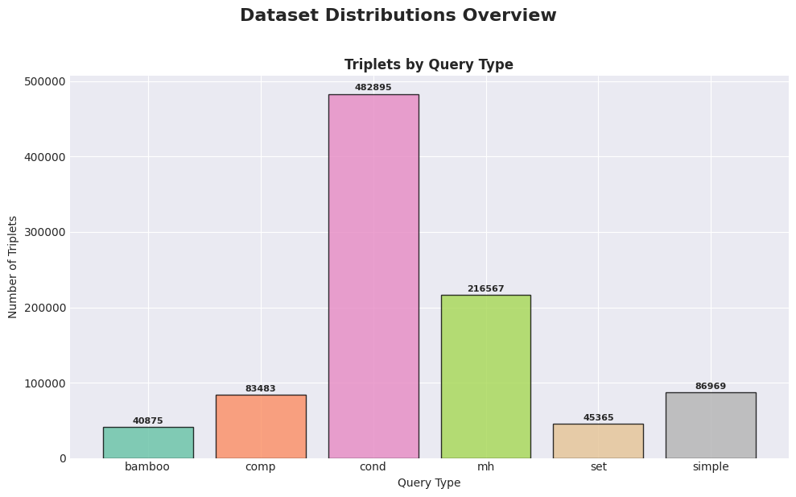
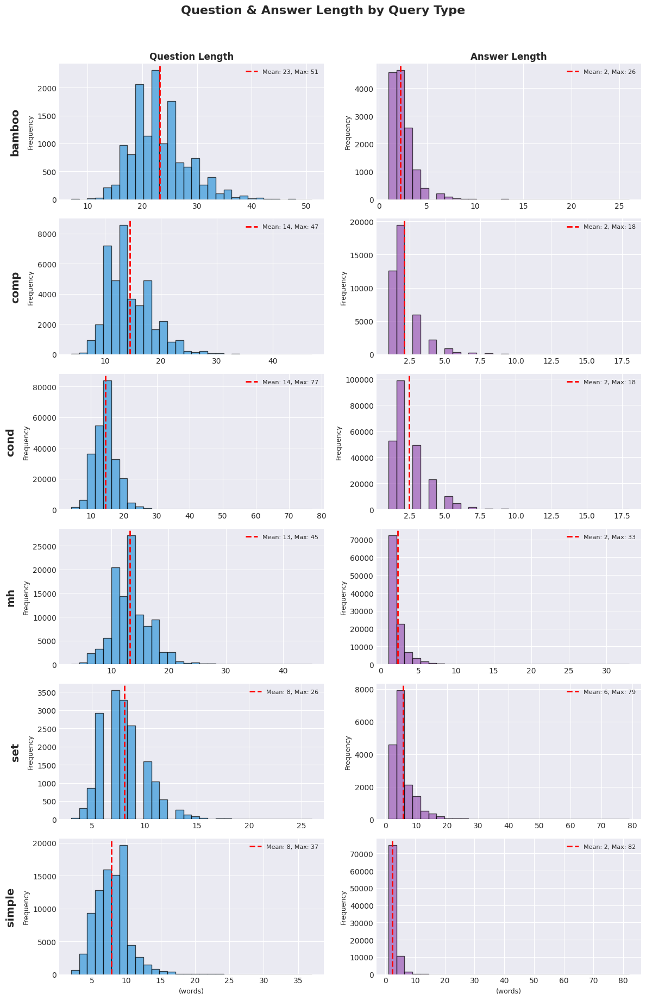
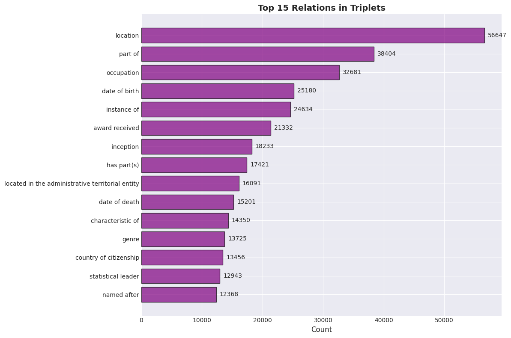
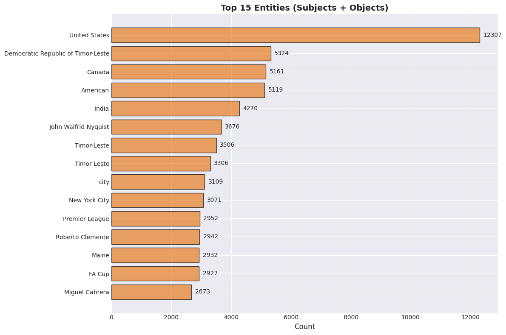

# MUSIQUE_GPT4_BATCH_GPT_OSS Multi-hop QA Dataset Analysis

## Overview

Multi-hop question-answering dataset generated from musique_gpt4_batch_gpt_oss using knowledge graph triplets.

## Dataset Information

- **Source**: `datasets/wikontic_kg/musique/musique_1000.json`
- **KG Dump**: `datasets/wikontic_kg/musique/kg_dump_musique_onto_triplets_db_llama.json`
- **Type**: musique

## Summary Statistics

| Metric | Value |
|--------|-------|
| Total Records | 510,101 |
| Records with QA | 510,101 (100.0%) |
| Unique Entry IDs | 1,000 |
| Unique Pages | 9,659 |
| Total Triplets | 956,154 |

## Distributions Overview



## Length Distributions by Query Type



## Top Relations



## Top Entities



## Data Format

### Parquet Schema
```
- path_id: string
- entry_id: string
- page_idx: int64
- page_title: string
- query_type: string
- path_length: int64
- triplets: JSON string
- context_text: string
- qa_pair: JSON string
```

### QA Pair Structure
```json
{
  "id": "PATH_1",
  "question": "Question text?",
  "answer": "Answer text"
}
```

### Triplets Structure
```json
[
  {
    "subject": "Entity",
    "relation": "relation",
    "object": "Value"
  }
]
```

---
*Generated: 2026-03-16 11:25:30*