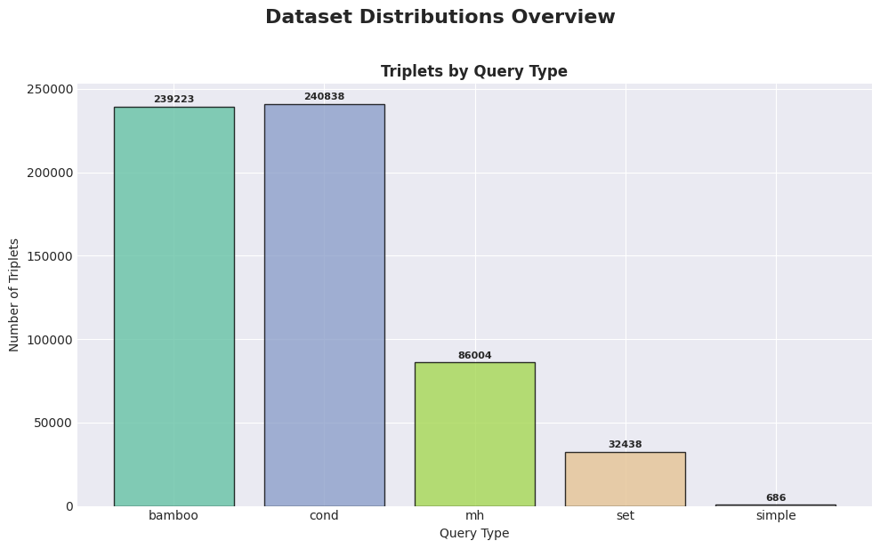
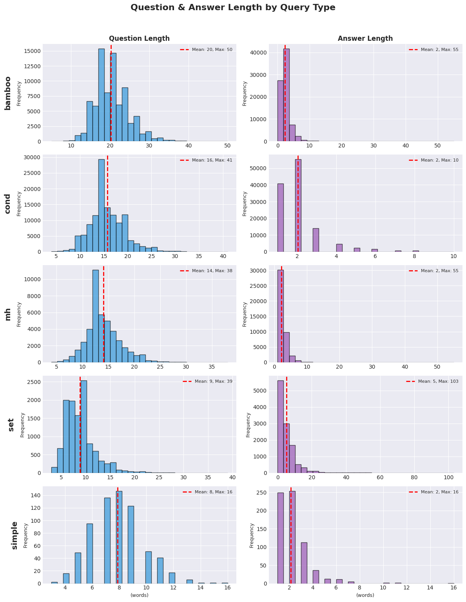
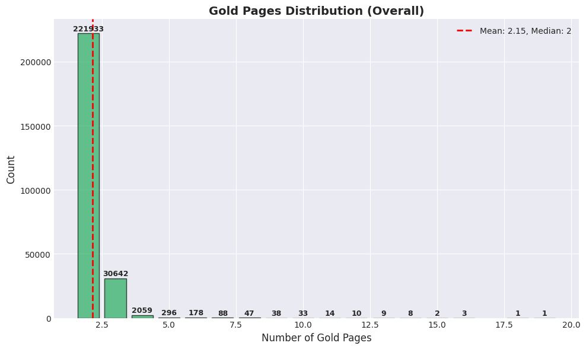
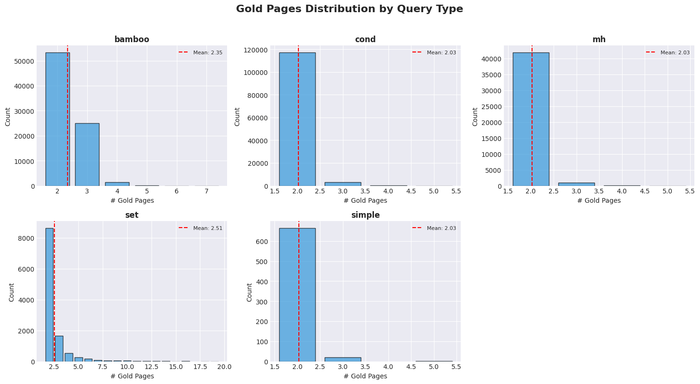
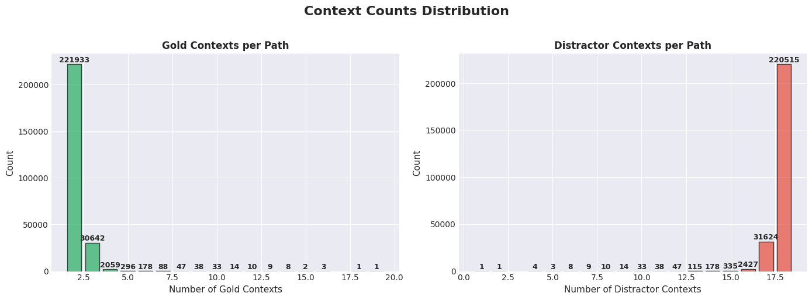
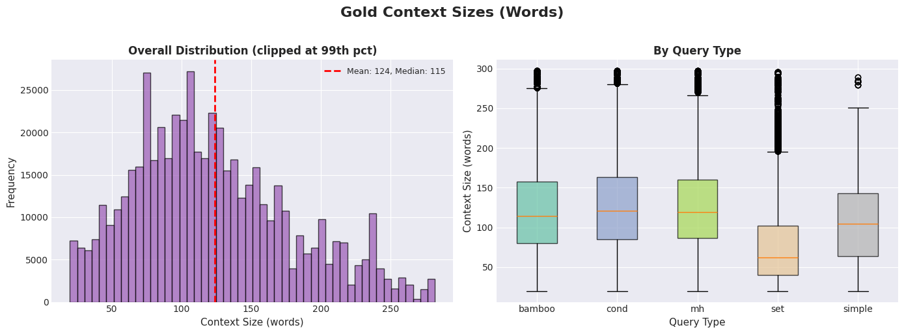
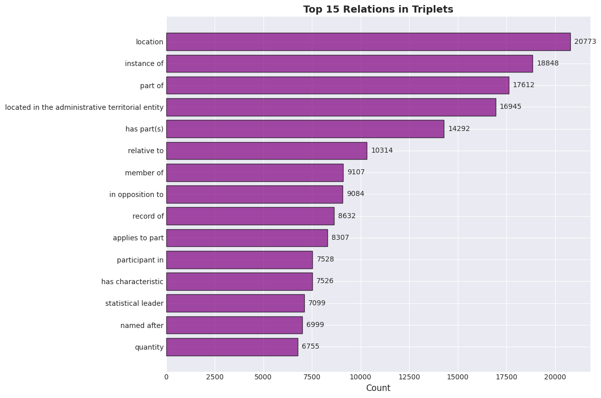
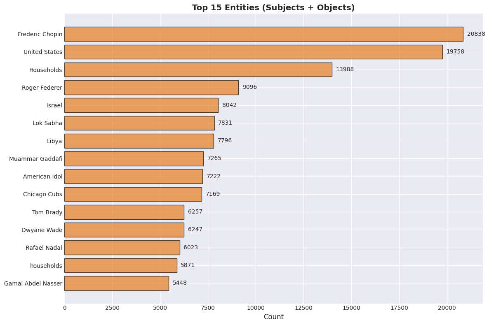
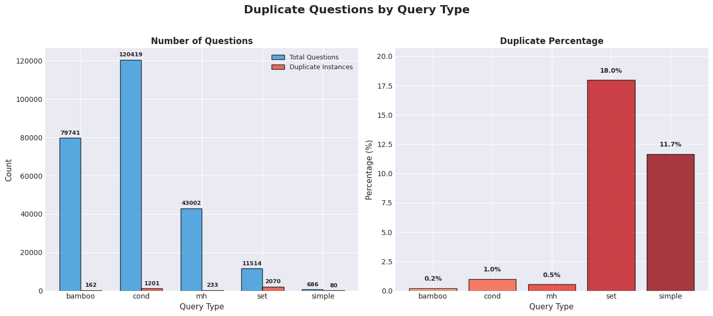

# MUSIQUE_TRAIN_MULTI_CONTEXT_31_MARCH Multi-hop QA Dataset Analysis

## Overview

Multi-hop question-answering dataset generated from musique_train_multi_context_31_march using knowledge graph triplets.

## Dataset Information

- **Source**: `multi_hop/datasets/wikontic_kg/musique/musique_train.json`
- **KG Dump**: `multi_hop/datasets/wikontic_kg/musique/31.03.2026/merged_kg_triplets.json`
- **Type**: musique

## Summary Statistics

| Metric | Value |
|--------|-------|
| Total Records | 255,362 |
| Records with QA | 255,362 (100.0%) |
| Unique Entry IDs | 2,029 |
| Total Triplets | 599,189 |
| Avg Gold Contexts | 2.15 |
| Avg Distractor Contexts | 17.84 |

## Step 2: SPARQL Query Statistics

| Metric | Value |
|--------|-------|
| Total Paths | 255,381 |
| Entries Processed | 2,076 |

### Paths by Query Type

| Query Type | Count |
|------------|-------|
| bamboo | 79,763 |
| cond | 120,417 |
| mh | 42,999 |
| set | 11,516 |
| simple | 686 |

### Path Length Distribution

| Length | Count |
|--------|-------|
| 1 | 686 |
| 10 | 53 |
| 11 | 31 |
| 12 | 20 |
| 13 | 16 |
| 14 | 20 |
| 15 | 10 |
| 16 | 7 |
| 17 | 5 |
| 18 | 3 |
| 19 | 3 |
| 2 | 171,060 |
| 20 | 3 |
| 21 | 1 |
| 22 | 1 |
| 24 | 2 |
| 25 | 1 |
| 27 | 1 |
| 28 | 1 |
| 3 | 81,716 |
| 4 | 795 |
| 5 | 368 |
| 6 | 270 |
| 7 | 154 |
| 8 | 92 |
| 9 | 62 |

## Distributions Overview



## Length Distributions by Query Type



## Gold Pages Distribution





## Context Counts Distribution



## Gold Context Sizes



## Top Relations



## Top Entities



## Duplicate Questions Analysis

| Query Type | Total Questions | Unique | Duplicates | Duplicate % |
|------------|-----------------|--------|------------|-------------|
| bamboo | 79,741 | 79,579 | 162 | 0.2% |
| cond | 120,419 | 119,218 | 1,201 | 1.0% |
| mh | 43,002 | 42,769 | 233 | 0.5% |
| set | 11,514 | 9,444 | 2,070 | 18.0% |
| simple | 686 | 606 | 80 | 11.7% |



## Data Format

### Parquet Schema
```
- path_id: string
- entry_id: string
- query_type: string
- path_length: int64
- triplets: JSON string
- gold_page_ids: JSON string (list of int)
- distractor_page_ids: JSON string (list of int)
- gold_contexts: JSON string (list of dicts)
- qa_pair: JSON string
```

### QA Pair Structure
```json
{
  "id": "PATH_1",
  "question": "Question text?",
  "answer": "Answer text"
}
```

### Triplets Structure
```json
[
  {
    "subject": "Entity",
    "relation": "relation",
    "object": "Value"
  }
]
```

### Gold Contexts Structure
```json
[
  {
    "page_idx": 0,
    "page_title": "Page Title",
    "context_text": "Context text..."
  }
]
```

---
*Generated: 2026-04-01 04:04:06*