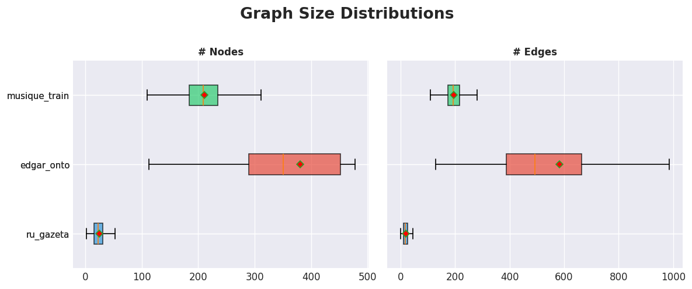
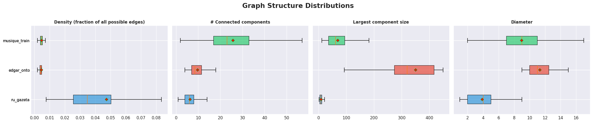
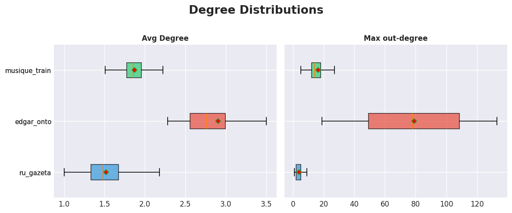
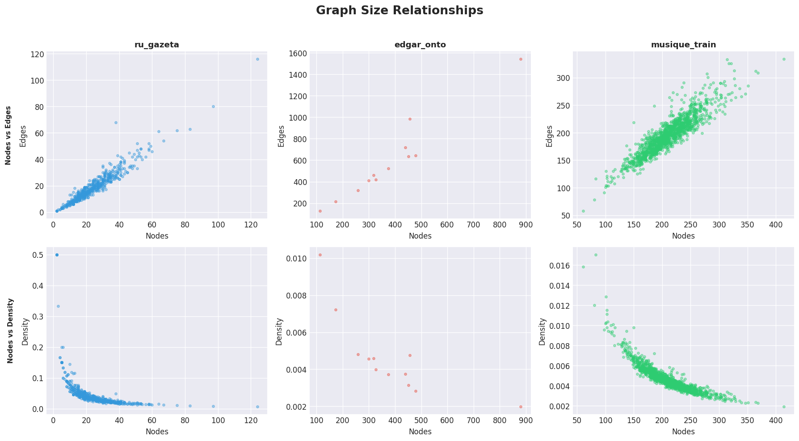
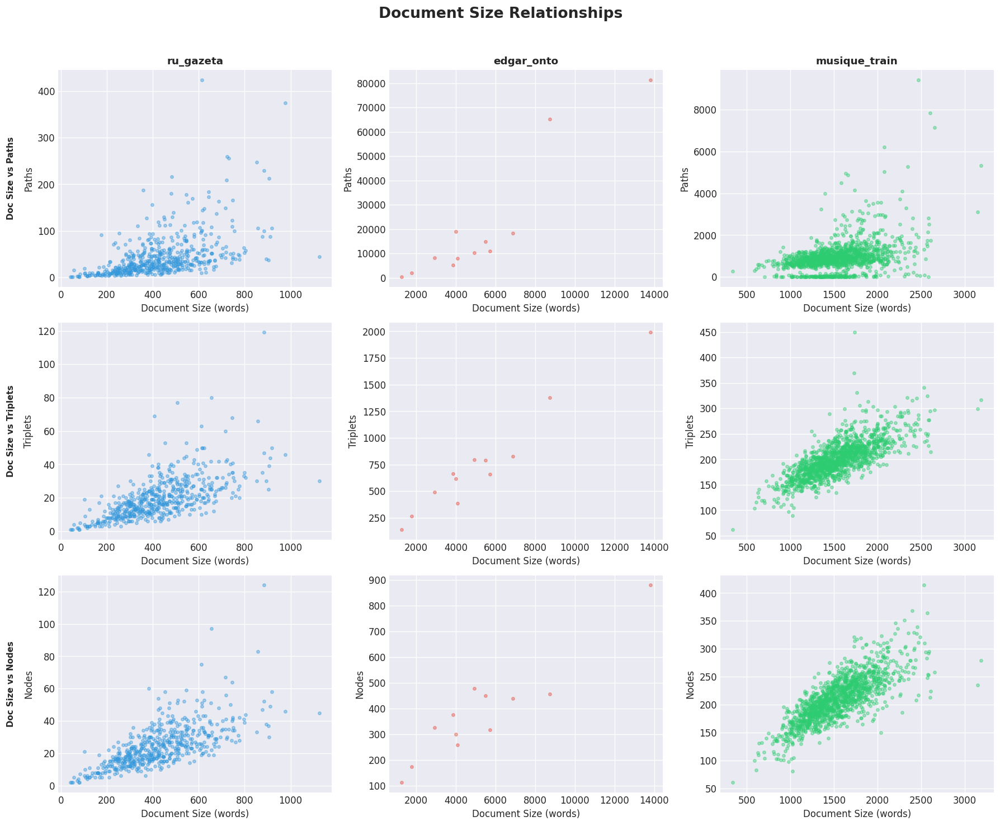

# Knowledge Graph Structure Analysis — Multi-Dataset Comparison

Comparing 3 datasets.

## ru_gazeta (540 entries)

| Metric | Min | Mean | Median | Max | Std |
|--------|-----|------|--------|-----|-----|
| # Nodes | 2.00 | 24.51 | 23.00 | 124.00 | 13.19 |
| # Edges | 1.00 | 19.12 | 17.00 | 116.00 | 11.80 |
| Density (fraction of all possible edges) | 0.01 | 0.05 | 0.03 | 0.50 | 0.05 |
| # Connected components | 1.00 | 6.41 | 6.00 | 24.00 | 3.46 |
| Largest component size | 2.00 | 9.64 | 8.00 | 83.00 | 6.93 |
| Diameter | 1.00 | 3.88 | 4.00 | 11.00 | 1.78 |
| Avg shortest path (mean distance between node pairs in the largest component) | 1.00 | 2.17 | 2.10 | 4.74 | 0.66 |
| Avg Degree | 1.00 | 1.52 | 1.48 | 3.58 | 0.28 |
| Max out-degree | 1.00 | 3.89 | 3.00 | 25.00 | 2.55 |

## edgar_onto (12 entries)

| Metric | Min | Mean | Median | Max | Std |
|--------|-----|------|--------|-----|-----|
| # Nodes | 113.00 | 380.58 | 350.50 | 880.00 | 186.21 |
| # Edges | 129.00 | 583.75 | 492.00 | 1542.00 | 364.34 |
| Density (fraction of all possible edges) | 0.00 | 0.00 | 0.00 | 0.01 | 0.00 |
| # Connected components | 4.00 | 9.75 | 8.50 | 18.00 | 3.68 |
| Largest component size | 93.00 | 350.25 | 319.50 | 838.00 | 180.73 |
| Diameter | 9.00 | 11.33 | 11.00 | 15.00 | 1.93 |
| Avg shortest path (mean distance between node pairs in the largest component) | 3.59 | 3.99 | 3.90 | 4.76 | 0.38 |
| Avg Degree | 2.28 | 2.91 | 2.76 | 4.32 | 0.54 |
| Max out-degree | 19.00 | 79.08 | 78.00 | 133.00 | 34.23 |

## musique_train (1408 entries)

| Metric | Min | Mean | Median | Max | Std |
|--------|-----|------|--------|-----|-----|
| # Nodes | 61.00 | 210.56 | 209.00 | 414.00 | 40.39 |
| # Edges | 58.00 | 195.78 | 194.00 | 334.00 | 34.24 |
| Density (fraction of all possible edges) | 0.00 | 0.00 | 0.00 | 0.02 | 0.00 |
| # Connected components | 2.00 | 25.73 | 23.00 | 83.00 | 12.85 |
| Largest component size | 12.00 | 69.69 | 61.00 | 259.00 | 40.76 |
| Diameter | 2.00 | 8.98 | 9.00 | 20.00 | 3.26 |
| Avg shortest path (mean distance between node pairs in the largest component) | 1.85 | 4.26 | 4.18 | 9.07 | 1.11 |
| Avg Degree | 1.47 | 1.87 | 1.86 | 2.92 | 0.15 |
| Max out-degree | 5.00 | 16.22 | 14.00 | 71.00 | 7.47 |

## Graph Size Distributions

## Graph Structure Distributions

## Degree Distributions

## Graph Size Relationships

## Document Size Relationships

---
*Generated: 2026-04-07 14:49:51*